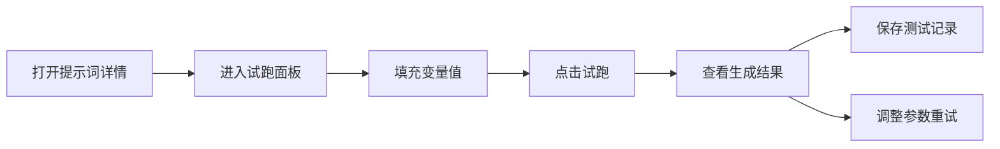
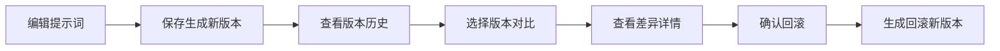

## 1. 产品概述

团队 Prompt 知识库是一款面向内容团队的提示词协作管理平台，帮助团队将常用提示词沉淀为可复用、可协作的数字资产，提升内容生产效率和质量。

- 核心目标：解决提示词散落在个人文档、难以沉淀和复用、缺乏版本管理和协作机制的问题
- 目标用户：内容运营团队、产品团队、AI 应用团队等需要频繁使用提示词的组织

## 2. 核心功能

### 2.1 用户角色

| 角色 | 说明 | 核心权限 |
|------|------|----------|
| 普通成员 | 团队普通用户 | 创建空间、编辑提示词、试跑测试、评论讨论 |
| 空间管理员 | 空间所有者 | 管理空间成员、设置权限、删除空间内容 |
| 系统管理员 | 平台管理员 | 查看全量数据、管理用户、清理废弃内容、查看活跃度 |

### 2.2 功能模块

1. **工作台**：数据概览、最近访问、快捷操作、我的任务
2. **空间列表**：业务空间管理、空间卡片、创建/编辑空间
3. **提示词编辑器**：富文本编辑、变量占位、使用步骤、示例输入、注意事项
4. **测试记录**：在线试跑、效果保存、历史记录对比
5. **版本管理**：版本历史、差异对比、版本回滚
6. **评审流程**：发起评审、评审意见、状态流转
7. **评论讨论**：实时评论、@提醒、讨论线程
8. **权限设置**：成员管理、角色分配、只读/可编辑权限
9. **批量操作**：批量导入、批量导出、批量移动
10. **回收站**：已删除内容、恢复、永久删除
11. **管理员后台**：活跃度统计、废弃内容清理、系统设置

### 2.3 页面详情

| 页面名称 | 模块名称 | 功能描述 |
|---------|---------|----------|
| 工作台 | 数据概览卡片 | 展示空间数、提示词数、测试次数、活跃度等指标 |
| 工作台 | 最近访问 | 展示最近访问的提示词和空间 |
| 工作台 | 快捷操作 | 快速创建提示词、创建空间、导入导出入口 |
| 空间列表 | 空间卡片网格 | 展示所有业务空间，支持搜索和筛选 |
| 空间列表 | 空间创建弹窗 | 创建新空间，设置名称、描述、图标 |
| 空间详情 | 提示词分类 | 按任务类型分类展示提示词卡片 |
| 空间详情 | 提示词卡片列表 | 展示提示词概要信息，支持搜索和排序 |
| 提示词编辑器 | 基础信息区 | 名称、描述、分类、标签 |
| 提示词编辑器 | 提示词内容区 | 富文本编辑器，支持变量占位符语法高亮 |
| 提示词编辑器 | 变量管理 | 定义变量名、类型、默认值 |
| 提示词编辑器 | 使用步骤 | 分步说明使用方法 |
| 提示词编辑器 | 示例输入输出 | 展示完整的使用示例 |
| 提示词编辑器 | 注意事项 | 重要提示和限制说明 |
| 试跑面板 | 变量填充 | 动态表单填充变量值 |
| 试跑面板 | 生成结果 | 展示试跑输出结果 |
| 试跑面板 | 保存记录 | 保存测试结果到历史记录 |
| 测试记录 | 历史记录列表 | 展示所有测试记录，支持筛选 |
| 测试记录 | 记录详情 | 查看完整测试输入输出 |
| 版本历史 | 版本列表 | 展示所有历史版本 |
| 版本历史 | 差异对比 | 对比两个版本的内容差异 |
| 版本历史 | 版本回滚 | 回滚到指定历史版本 |
| 评审中心 | 评审列表 | 待评审、进行中、已完成的评审 |
| 评审中心 | 评审详情 | 评审意见、状态流转、评论讨论 |
| 评论区 | 评论列表 | 展示所有评论和回复 |
| 评论区 | 评论输入 | 发表评论、@成员、上传附件 |
| 权限设置 | 成员列表 | 展示空间成员和角色 |
| 权限设置 | 成员邀请 | 邀请新成员加入空间 |
| 权限设置 | 角色管理 | 设置只读/可编辑/管理员权限 |
| 回收站 | 已删除列表 | 展示已删除的提示词和空间 |
| 回收站 | 恢复操作 | 恢复已删除的内容 |
| 回收站 | 永久删除 | 彻底删除不可恢复 |
| 管理员后台 | 活跃度统计 | 团队活跃度趋势图表 |
| 管理员后台 | 废弃内容 | 识别长期未使用的内容 |
| 管理员后台 | 批量清理 | 批量清理废弃内容 |

## 3. 核心流程

### 3.1 提示词创建流程

用户从工作台或空间列表进入空间，点击创建提示词，填写基础信息、提示词内容、变量定义、使用步骤、示例和注意事项，保存后发布。

### 3.2 试跑测试流程

用户打开提示词详情，切换到试跑面板，填充变量值，点击试跑按钮，查看生成结果，可选择保存测试记录。

### 3.3 版本管理流程

用户编辑提示词后自动生成新版本，可在版本历史中查看所有版本，对比两个版本的差异，必要时回滚到历史版本。

## 4. 用户界面设计

### 4.1 设计风格

- **主色调**：深邃蓝紫渐变（#6366F1 → #8B5CF6），代表科技感和创造力
- **辅助色**：翡翠绿（#10B981）用于成功状态，琥珀橙（#F59E0B）用于警告，玫瑰红（#F43F5E）用于错误
- **中性色**：深灰到近黑的背景（#0F172A → #1E293B），配合浅灰文字，营造专业沉浸式体验
- **按钮风格**：圆角中等（8px），主按钮使用渐变背景，悬停时有微妙的光晕效果
- **字体**：标题使用 Space Grotesk，正文使用 Inter，代码区使用 JetBrains Mono
- **布局风格**：三栏布局（侧边导航 + 主内容区 + 右侧面板），卡片式设计，毛玻璃效果点缀
- **图标风格**：线性图标，配合统一的圆角风格

### 4.2 页面设计概览

| 页面名称 | 模块名称 | UI 元素 |
|---------|---------|---------|
| 工作台 | 数据概览 | 渐变卡片、数字动画、图标点缀、悬停上浮效果 |
| 工作台 | 最近访问 | 横向滚动列表、卡片缩略、时间标签 |
| 空间列表 | 空间网格 | 彩色图标卡片、渐变边框、悬停缩放 |
| 提示词编辑器 | 编辑区 | 分栏布局、左侧导航、中间编辑、右侧预览 |
| 提示词编辑器 | 变量高亮 | 变量占位符特殊样式、悬停显示变量信息 |
| 试跑面板 | 结果区 | 深色代码块、语法高亮、复制按钮 |
| 版本对比 | 差异区 | 左右分栏、新增绿色背景、删除红色删除线 |
| 评论区 | 评论列表 | 头像气泡、时间戳、回复缩进 |

### 4.3 响应式设计

- 桌面端：三栏布局，内容区最大宽度 1440px
- 平板端：两栏布局，右侧面板可折叠
- 移动端：单栏布局，侧边导航改为抽屉式，底部导航栏

### 4.4 动效设计

- 页面加载：元素渐入 + 轻微上移，stagger 延迟
- 卡片悬停：轻微上浮 + 阴影加深 + 边框高亮
- 按钮交互：点击时缩放反馈，渐变流动效果
- 模态框：背景模糊 + 缩放进入
- 列表项：添加/删除时的平滑过渡
