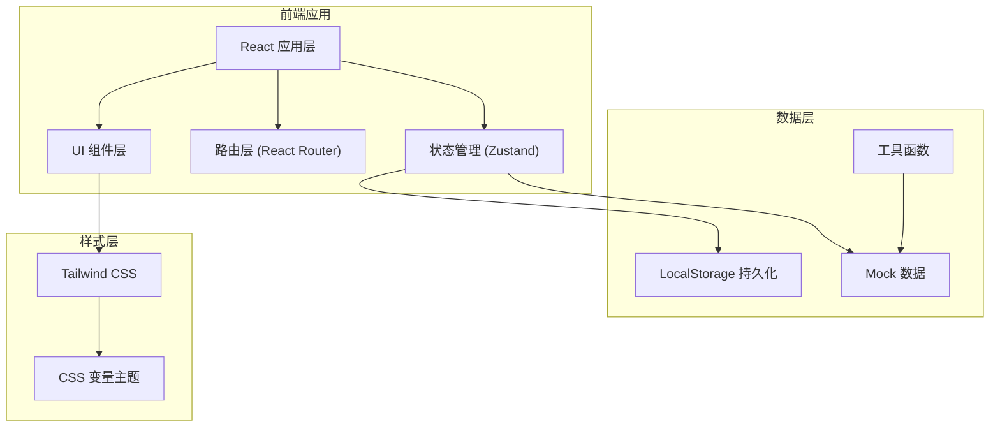
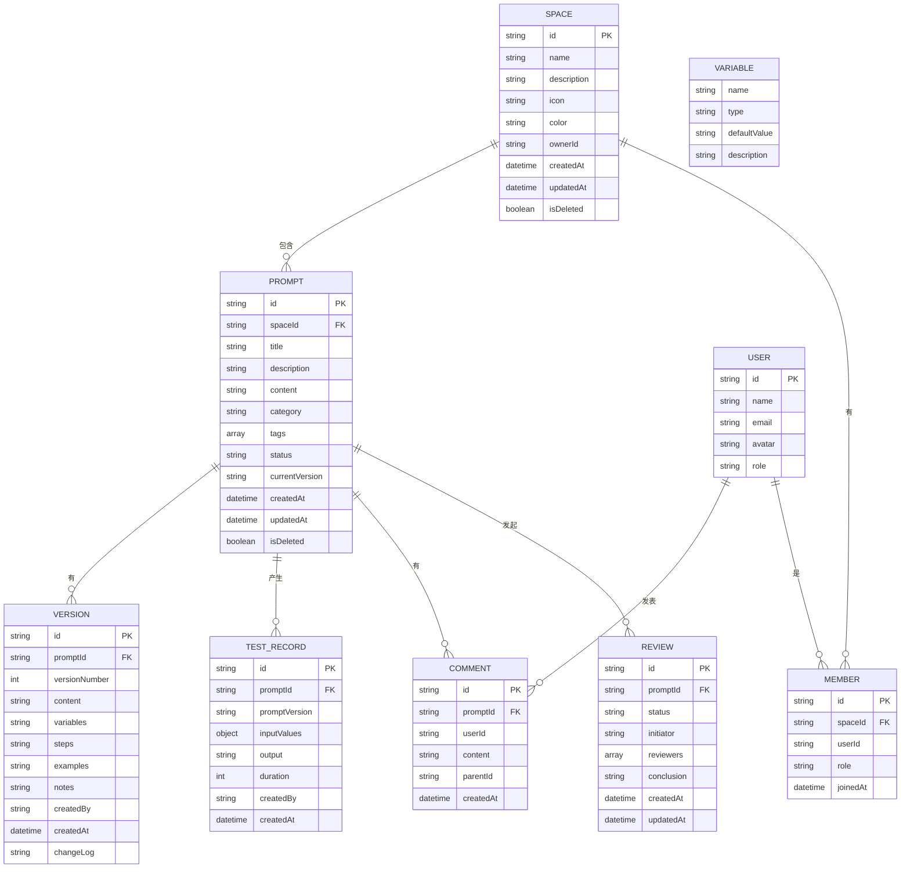

## 1. 架构设计



## 2. 技术栈说明

- **前端框架**：React@18 + TypeScript
- **构建工具**：Vite@5
- **样式方案**：Tailwind CSS@3 + CSS 变量
- **路由管理**：React Router DOM@6
- **状态管理**：Zustand
- **图标库**：Lucide React
- **数据持久化**：LocalStorage（前端模拟）
- **代码高亮**：Prism.js / highlight.js
- **动画库**：Framer Motion
- **表单处理**：React Hook Form

## 3. 路由定义

| 路由路径 | 页面名称 | 说明 |
|---------|---------|------|
| `/` | 工作台 | 数据概览、最近访问、快捷操作 |
| `/spaces` | 空间列表 | 所有业务空间展示和管理 |
| `/spaces/:spaceId` | 空间详情 | 空间内提示词列表 |
| `/spaces/:spaceId/prompts/:promptId` | 提示词详情 | 提示词查看和编辑 |
| `/spaces/:spaceId/prompts/new` | 新建提示词 | 创建新提示词 |
| `/tests` | 测试记录 | 所有测试记录列表 |
| `/reviews` | 评审中心 | 评审列表和详情 |
| `/recycle` | 回收站 | 已删除内容管理 |
| `/admin` | 管理员后台 | 活跃度统计和系统管理 |
| `/settings` | 权限设置 | 空间成员和权限管理 |

## 4. 数据模型

### 4.1 实体关系图



### 4.2 数据结构定义

```typescript
// 空间
interface Space {
  id: string;
  name: string;
  description: string;
  icon: string;
  color: string;
  ownerId: string;
  createdAt: Date;
  updatedAt: Date;
  isDeleted: boolean;
}

// 提示词
interface Prompt {
  id: string;
  spaceId: string;
  title: string;
  description: string;
  content: string;
  category: string;
  tags: string[];
  status: 'draft' | 'published' | 'archived';
  currentVersion: number;
  variables: Variable[];
  steps: Step[];
  examples: Example[];
  notes: string;
  createdAt: Date;
  updatedAt: Date;
  isDeleted: boolean;
}

// 变量
interface Variable {
  name: string;
  type: 'text' | 'number' | 'select' | 'textarea';
  defaultValue: string;
  description: string;
  options?: string[];
}

// 使用步骤
interface Step {
  order: number;
  title: string;
  description: string;
}

// 示例
interface Example {
  title: string;
  input: string;
  output: string;
}

// 版本
interface Version {
  id: string;
  promptId: string;
  versionNumber: number;
  content: string;
  variables: Variable[];
  steps: Step[];
  examples: Example[];
  notes: string;
  createdBy: string;
  createdAt: Date;
  changeLog: string;
}

// 测试记录
interface TestRecord {
  id: string;
  promptId: string;
  promptVersion: number;
  inputValues: Record<string, string>;
  output: string;
  duration: number;
  createdBy: string;
  createdAt: Date;
}

// 评论
interface Comment {
  id: string;
  promptId: string;
  userId: string;
  userName: string;
  userAvatar: string;
  content: string;
  parentId: string | null;
  createdAt: Date;
}

// 评审
interface Review {
  id: string;
  promptId: string;
  promptTitle: string;
  status: 'pending' | 'reviewing' | 'approved' | 'rejected';
  initiator: string;
  reviewers: string[];
  conclusion: string;
  comments: ReviewComment[];
  createdAt: Date;
  updatedAt: Date;
}

// 成员
interface Member {
  id: string;
  userId: string;
  spaceId: string;
  name: string;
  avatar: string;
  role: 'owner' | 'admin' | 'editor' | 'viewer';
  joinedAt: Date;
}

// 用户
interface User {
  id: string;
  name: string;
  email: string;
  avatar: string;
  role: 'admin' | 'member';
}

// 回收站项目
interface RecycleItem {
  id: string;
  type: 'space' | 'prompt';
  title: string;
  deletedBy: string;
  deletedAt: Date;
  originalData: any;
}
```

## 5. 项目目录结构

```
src/
├── components/          # 通用组件
│   ├── Layout/         # 布局组件
│   ├── Card/           # 卡片组件
│   ├── Button/         # 按钮组件
│   ├── Modal/          # 模态框
│   ├── Input/          # 输入组件
│   ├── Tag/            # 标签组件
│   ├── Avatar/         # 头像组件
│   └── Empty/          # 空状态组件
├── pages/              # 页面组件
│   ├── Dashboard/      # 工作台
│   ├── Spaces/         # 空间列表
│   ├── SpaceDetail/    # 空间详情
│   ├── PromptEditor/   # 提示词编辑器
│   ├── TestRecords/    # 测试记录
│   ├── Reviews/        # 评审中心
│   ├── Recycle/        # 回收站
│   ├── Admin/          # 管理员后台
│   └── Settings/       # 权限设置
├── store/              # 状态管理
│   ├── useSpaceStore.ts
│   ├── usePromptStore.ts
│   ├── useUserStore.ts
│   └── useUIStore.ts
├── mock/               # Mock 数据
│   ├── spaces.ts
│   ├── prompts.ts
│   ├── users.ts
│   └── tests.ts
├── types/              # 类型定义
│   └── index.ts
├── utils/              # 工具函数
│   ├── storage.ts
│   ├── diff.ts
│   ├── export.ts
│   └── helpers.ts
├── hooks/              # 自定义 Hooks
│   ├── useDebounce.ts
│   └── useLocalStorage.ts
├── styles/             # 全局样式
│   └── globals.css
├── App.tsx
├── main.tsx
└── router.tsx
```

## 6. 核心技术决策

1. **纯前端架构**：使用 LocalStorage 模拟后端，便于演示和单机使用
2. **Zustand 状态管理**：轻量级状态管理，支持持久化中间件
3. **组件化设计**：原子化组件 + 业务组件双层结构
4. **主题系统**：基于 CSS 变量的深色主题，支持未来扩展浅色模式
5. **性能优化**：使用 React.memo、useMemo、useCallback 等优化渲染性能
6. **可访问性**：遵循 WAI-ARIA 规范，支持键盘导航
